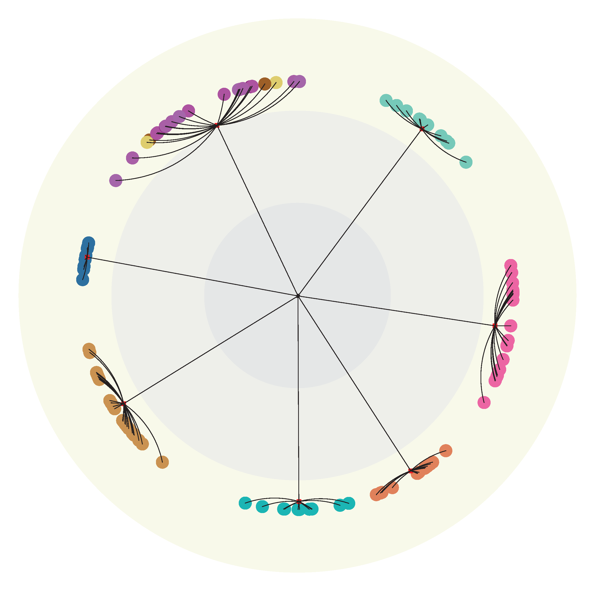
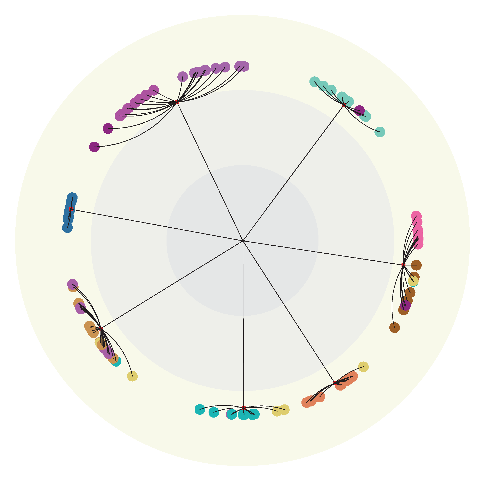

# LSEnet

LSEnet: Lorentz Structural Entropy Neural Network for Deep Graph Clustering.

## Get Started

```bash
cd ./LSEnet
python main.py
```

## Visualization

<div align=center>

</div>
<div align=center>
Figure 1. Prediction results on FootBall dataset.
</div>
<br><br>
<div align=center>

</div>
<div align=center>
Figure 2. True labels of FootBall dataset.
</div>
# deep_graph_clustering
sbatch --gres=gpu:a100:1 -C a100_80 --time=24:00:00 --output=res_lsenet.txt fau_alex_job_script.sh

inf values: 
INFO - 03/11/25 09:33:44 - 0:00:00 - {'dataset': 'SeNet', 'task': 'Clustering', 'root_path': './datasets', 'eval_freq': 100, 'exp_iters': 5, 'version': 'run', 'log_path': './results/run/SeNet.log', 'pre_epochs': 200, 'epochs': 1500, 'height': 5, 'lr_pre': 0.01, 'lr': 0.01, 'w_decay': 0.0, 'decay_rate': 9, 'max_nums': None, 'embed_dim': 32, 'hidden_dim_enc': 64, 'hidden_dim': 64, 'dropout': 0.0, 'nonlin': None, 'temperature': 0.2, 'n_cluster_trials': 5, 't': 1.0, 'r': 2.0, 'patience': 5, 'save_path': 'model.pt', 'use_gpu': True, 'gpu': 0, 'devices': '0,1', 'data_path': './datasets/affinity_matrix_from_senet_sparse_20000.npz', 'label_path': './datasets/senet_label_20000.csv'}

WARNING - 03/11/25 10:21:36 - 0:47:52 - Traceback: Traceback (most recent call last):
                                          File "/home/hpc/v100dd/v100dd15/.conda/envs/clustering_env/lib/python3.9/site-packages/smac/runner/target_function_runner.py", line 190, in run
                                            rval = self(config_copy, target_function, kwargs)
                                          File "/home/hpc/v100dd/v100dd15/.conda/envs/clustering_env/lib/python3.9/site-packages/smac/runner/target_function_runner.py", line 264, in __call__
                                            return algorithm(config, **algorithm_kwargs)
                                          File "/home/atuin/v100dd/v100dd15/python_code/deep_graph_clustering/deep_graph_clustering/./main_with_smac.py", line 103, in train
                                            ari = exp.train()
                                          File "/home/atuin/v100dd/v100dd15/python_code/deep_graph_clustering/deep_graph_clustering/exp.py", line 55, in train
                                            nmi, ari = self.train_clu(data, model, optimizer, logger, device, exp_iter)
                                          File "/home/atuin/v100dd/v100dd15/python_code/deep_graph_clustering/deep_graph_clustering/exp.py", line 94, in train_clu
                                            loss = model.loss(data, data['edge_index'], data['neg_edge_index'], device)
                                          File "/home/atuin/v100dd/v100dd15/python_code/deep_graph_clustering/deep_graph_clustering/models/hyperSE.py", line 88, in loss
                                            ass_j = ass_mat[k][edge_index[1]]
                                        torch.OutOfMemoryError: CUDA out of memory. Tried to allocate 5.69 GiB. GPU 0 has a total capacity of 79.25 GiB of which 4.89 GiB is free. Including non-PyTorch memory, this process has 74.35 GiB memory in use. Of the allocated memory 73.25 GiB is allocated by PyTorch, and 615.51 MiB is reserved by PyTorch but unallocated. If reserved but unallocated memory is large try setting PYTORCH_CUDA_ALLOC_CONF=expandable_segments:True to avoid fragmentation.  See documentation for Memory Management  (https://pytorch.org/docs/stable/notes/cuda.html#environment-variables)
                                        
